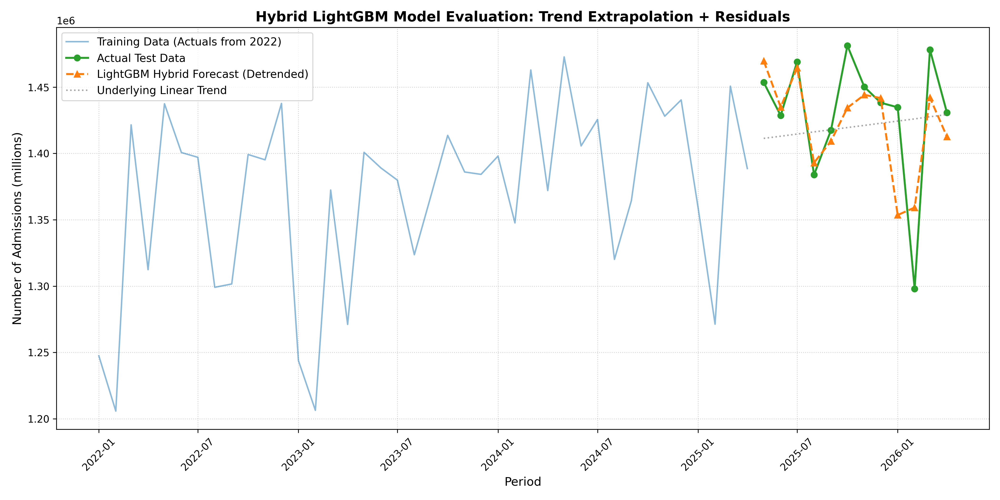
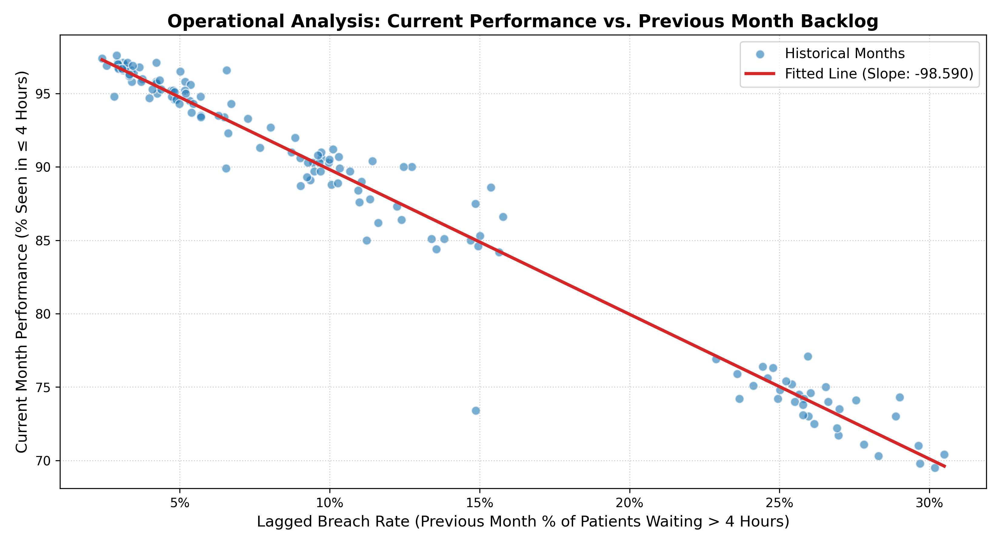

# NHS Healthcare Operations: Predictive Forecasting & System Stress Analysis

An end-to-end data science and operational analytics project targeting NHS Accident & Emergency (A&E) data. This repository contains two core analytical workflows designed to optimize hospital resource allocation: predicting future admission volumes and quantifying compounding institutional backlogs.

## 📊 Key Results
* **Halved the forecasting error (MAE)** of standard machine learning tree models by engineering a custom **Linear Regression + LightGBM Target Detrending Hybrid**.
* **Quantified a 1-to-1 negative "hangover effect"** in hospital performance using econometric OLS modeling, proving that a 1% increase in past patient breaches directly drags down the following month's operational throughput by ~0.98%.

---

## 📂 Repository Structure
* `a&e_admissions_forecasting.ipynb`: Time series engineering and forecasting pipeline comparing statistical models (SARIMA) against hybrid machine learning models (LightGBM).
* `operational_performance_analysis.ipynb`: Diagnostic regression modeling analyzing the 4-hour NHS wait target, operational backlogs, and "exit-blocking" mechanics.

---

## 🛠️ Project Deep-Dives

### 1. Advanced Time Series Forecasting (`a&e_admissions_forecasting.ipynb`)

**The Challenge:** Predicting major (Type 1) A&E monthly admissions. Traditional models were heavily warped by the macro-structural anomaly of the 2020 COVID-19 lockdowns. Furthermore, standard gradient-boosted decision trees (LightGBM/XGBoost) suffered from "trend blindness," completely failing to extrapolate the rising baseline demand of the NHS and creating an artificial forecast ceiling.

**The Solution:**
1. **Anomaly Mitigation:** Parsimoniously isolated and excluded the structural break of the pandemic window to ensure clean seasonal baseline training.
2. **Hybrid Target Detrending Architecture:** Implemented a two-stage modeling approach:
   * Fit an Ordinary Least Squares (OLS) linear trend to capture the macro upward trajectory.
   * Trained a **LightGBM Regressor** explicitly on the *residuals (flat seasonal waves)* using engineered temporal features and historical lags (Lag-1, Lag-12).
   * Recomposed the final forecast by superimposing the tree-based variations back onto the linear escalator.

**Result:** This custom hybrid setup successfully bypassed the mathematical limits of pure tree architectures, allowing the model to accurately capture sharp, non-linear winter surges while following the long-term trend line.



---

### 2. Operational Backlog Diagnostic Modeling (`operational_performance_analysis.ipynb`)

**The Challenge:**
Hospital operational performance is notoriously volatile. This notebook shifts focus from pure volume to system *acuity and efficiency*, evaluating whether past bottlenecks cause a compounding operational "hangover" in subsequent cycles due to systemic exit-blocking (lack of inpatient beds).

**The Solution:**
* Engineered a trend-independent **Operational Breach Rate** feature, isolating pure system efficiency from raw monthly admission sizes.
* Constructed a diagnostic OLS model mapping current month target success against the previous month’s normalized backlog.

**Result:**
The model uncovered a highly significant, tight negative linear correlation ($p < 0.001$). For every **1% increase in the patient breach rate this month, the hospital's operational capability to hit the 4-hour target next month drops by 0.98%**. This strongly confirms the structural "exit-blocking" hypothesis and provides a powerful predictive feature for future resource scheduling.



---

## 📈 Tech Stack & Methodologies
* **Data Manipulation:** `pandas`, `numpy`
* **Statistical & Time Series Modeling:** `statsmodels` (OLS, Diagnostic Metrics), `pmdarima` (SARIMA)
* **Machine Learning:** `LightGBM` (Gradient Boosted Trees), `scikit-learn` (Linear Regression)
* **Data Visualization:** `matplotlib`, `seaborn`
* **Core Concepts:** Target Detrending, Time-Series Feature Engineering, Lag Analysis, Anomaly Management, Operational KPI Optimization.

---

## 🚀 How to Run the Analysis
1. Clone the repository:
   ```bash
   git clone [https://github.com/your-username/your-repo-name.git](https://github.com/your-username/your-repo-name.git)